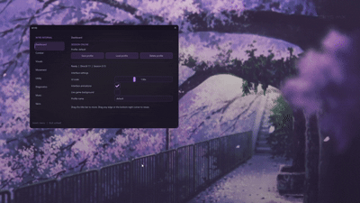
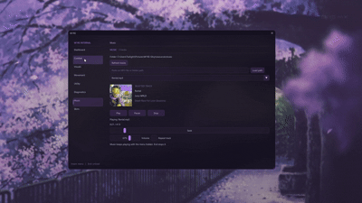

<div align="center">

<br><br>

# Wire HVH

### Premium Counter-Strike 2 Client Modification


<br>


<br><br>

</div>

## About

**Wire HVH** is an experimental Counter-Strike 2 client modification designed for private testing and development.

The software is intended to be run using:

```text
-insecure
```

This disables access to VAC-secured/public servers.

Use of Wire HVH outside of its intended environment is at your own risk. Do not use it on servers where third-party modifications are prohibited.

---

## Features

- Music Player
- Aim Assist / Trigger Bot
- ESP / Chams / Snaplines
- Bunny Hop

---

## Planned

> These features are currently experimental, incomplete, or broken.

- SkinChanger
- Anti-Aim / SpinBot
- Anti-AFK
- Quick Respawn
- Auto-Farm
- Third-Person POV
- Persistent Install

---

## Showcase

<div align="center">

### Current Build




<br><br>

<sub>Non-final build. Interface and functionality may change.</sub>

</div>

---

<div align="center">

### Wire HVH

`Counter-Strike 2` • `C++` • `Windows` • `Experimental`

</div>
